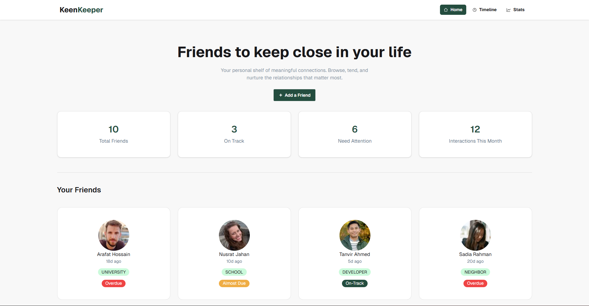

# KeenKeeper - Keep Your Friendships Alive

A responsive web application that helps users track and manage their friendships. Users can log interactions like calls, texts, and video chats, view them in a timeline, and analyze their communication patterns through a simple analytics dashboard.

---

## Live Links

- Live Demo: https://ph-a07-b13.vercel.app/
- Client Repository: https://github.com/yashakib-dev/PH-A07-B13

---

## Preview



---

## Project Overview

KeenKeeper is a friendship management and interaction tracking platform designed to help users maintain meaningful relationships. It allows users to log communication activities, visualize interaction history, and gain insights into their social engagement patterns.

---

## Key Features

- Log interactions (Call, Text, Video Call)
- View interaction history in a timeline format
- Filter timeline by interaction type
- Visualize communication data using pie charts
- Toast notifications for user actions
- Fully responsive design (mobile, tablet, desktop)

---

## Tech Stack

### Frontend
- Next.js
- Tailwind CSS
- DaisyUI
- React Context API
- React Icons
- React Toastify
- Recharts

### Deployment
- Vercel

### Tools
- Git
- GitHub
- VS Code
---

## Main Pages

- Home Page
- Timeline Page
- Friendship Analytics Page
---


## Setup Instructions
1. Clone the repository
```bash
git clone https://github.com/yashakib-dev/PH-A07-B13.git
```
2. Install dependencies
```bash
npm install
```
3. Run the project
```bash
npm run dev
```

## Author
Name: Yeakub Ali Shakib <br>
Portfolio: https://ya-shakib-portfolio.vercel.app/ <br>
LinkedIn: https://www.linkedin.com/in/yashakib/ <br>
GitHub: https://github.com/yashakib-dev
